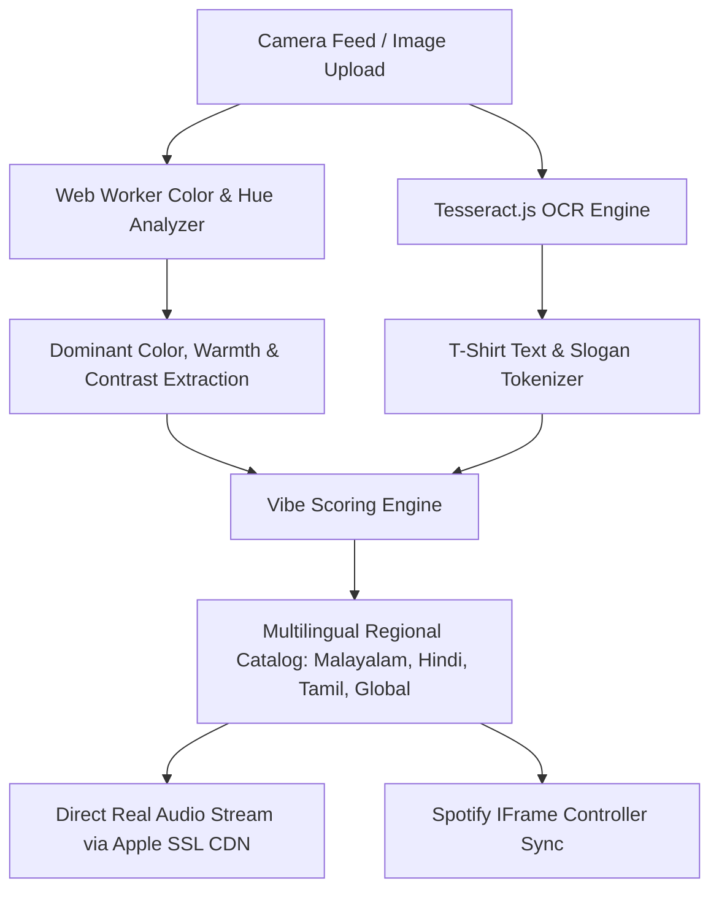

# ithinoru-pattu 🎵 🎯
> *Your look. Your vibe. Your soundtrack.*

---

## Basic Details

### Team Name: **Coffee Coders**

### Team Members
- **Team Lead:** Vishnupriya M. V. — *Sahrdaya College of Engineering and Technology*
- **Member 2:** Thanushree Suresh — *Sahrdaya College of Engineering and Technology*

---

## Project Description

**Ithinoru Pattu** is an automated, real-time AI outfit-to-soundtrack matcher that watches your clothes through your camera, reads whatever words or slogans are printed on your T-shirt, and immediately blasts the exact Malayalam, Hindi, Tamil, or Global banger that matches your look. Because your outfit shouldn't have to exist in silence.

---

## The Problem (that doesn't exist)

Every day, millions of people walk around wearing killer outfits, shades, gold chains, or witty slogan T-shirts, but real life doesn't come with background music. You walk into a room looking like Fahadh Faasil in *Aavesham* or The Weeknd in *Starboy*, yet all you hear is the ceiling fan spinning and awkward silence. Humans have suffered for centuries with no automated cinematic entrance score for their daily drip.

---

## The Solution (that nobody asked for)

**Ithinoru Pattu** (*Malayalam for "A Song for This"*) permanently eliminates this crisis!
1. **Flash your fit:** Stand in front of your webcam or upload a photo of your outfit.
2. **On-Device Vision & OCR:** The app analyzes your color palette, lighting temperature, and scans your T-shirt for slogans, words, or emojis using client-side OCR.
3. **Instant Audio Drop:** Instead of waiting or guessing, it calculates your aesthetic vector and instantly plays real 30-second SSL audio previews and Spotify tracks.
4. **Multilingual Vibe Matching:** Filter by Malayalam, Hindi, Tamil, or Global hits, or switch social modes for Solo, Duo, or Group squad checks!

---

## Technical Details

### Technologies/Components Used

#### For Software:
- **Languages used:** TypeScript, JavaScript, HTML5, Modern CSS3
- **Frameworks used:** Vite (fast local development & build system)
- **Libraries used:** 
  - `tesseract.js` (client-side optical character recognition for T-shirt text detection)
  - `canvas` Web APIs & Web Audio API (real-time audio synthesis fallback & visualizer)
  - Spotify IFrame API & Apple CDN SSL Audio Streaming (direct in-browser playback)
- **Tools used:** Git, GitHub, VS Code, Google Chrome DevTools

#### For Hardware:
- **Main components:** Standard Laptop/Desktop HD Webcam or Mobile Phone Camera (N/A - Pure Software Solution with webcam input)
- **Specifications:** Any standard 720p or 1080p camera device with WebRTC support
- **Tools required:** Modern web browser (Chrome, Edge, Firefox, Safari)

---

## Implementation

### For Software:

#### Installation
```bash
# 1. Clone the repository
git clone https://github.com/vishnupriya759285/coffee-coders.git

# 2. Enter the project directory
cd coffee-coders

# 3. Install required dependencies
npm install
```

#### Run
```bash
# Start the local development server
npm run dev

# Open http://localhost:5173 in your browser
```

---

## Project Documentation

### For Software:

#### Screenshots


*Studio Dashboard: Live camera feed with real-time color swatches, T-shirt text detection, and symmetrical navigation dock.*


*Music Player Flow: Active playback deck with revolving album vinyl, interactive waveform visualizer, and ranked recommendations.*


*Vibe Analysis Details: Collapsible dropdown menu revealing deep visual confidence metrics, detected T-shirt slogans, and formula tags.*

#### Diagrams


*Ithinoru Pattu end-to-end processing pipeline: Private on-device computer vision and OCR matching to real streaming tracks.*

---

### For Hardware:
*N/A — Pure Software Web Application utilizing standard client camera hardware.*

---

## Project Demo

### Video
https://drive.google.com/file/d/1Dh0zfysD0te87shpRW62XWnz5mkH4aKN/view?usp=sharing
*Demonstrates live webcam scanning, T-shirt text detection, and instant music playback of matching regional anthems.*

### Additional Demos
- **Language Switcher:** Filter soundtracks instantly between *All*, *Malayalam*, *Hindi*, *Tamil*, and *Global*.
- **Social Mode Toggles:** Switch between *Solo Vibe*, *Duo Fit Check*, and *Squad Mode* to rank group aesthetic harmony.
- **Privacy Assurance:** 100% on-device image processing — no video frames or personal images leave your browser.

---

## Team Contributions

- **Vishnupriya M. V. (Team Lead):** Architectural design, modern symmetrical studio UI/UX, direct audio preview player integration, Spotify IFrame controller synchronization, and project coordination.
- **Thanushree Suresh:** Computer vision processing pipeline, Tesseract OCR integration for T-shirt slogans, multilingual music registry curation (Malayalam, Hindi, Tamil, Global), and social vibe scoring algorithms.

---

Made with ❤️ at **TinkerHub Useless Projects**
